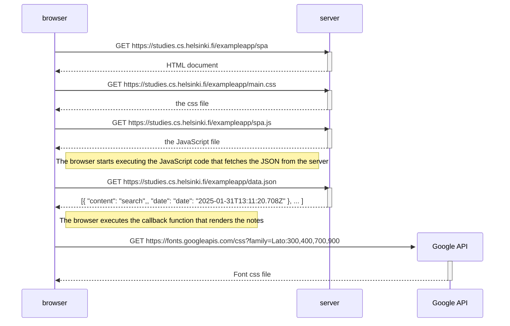

```mermaid

sequenceDiagram
    participant browser
    participant server

    browser->>server: GET https://studies.cs.helsinki.fi/exampleapp/spa
    activate server
    server-->>browser: HTML document
    deactivate server

    browser->>server: GET https://studies.cs.helsinki.fi/exampleapp/main.css
    activate server
    server-->>browser: the css file
    deactivate server

    browser->>server: GET https://studies.cs.helsinki.fi/exampleapp/spa.js
    activate server
    server-->>browser: the JavaScript file
    deactivate server

    Note right of browser: The browser starts executing the JavaScript code that fetches the JSON from the server

    browser->>server: GET https://studies.cs.helsinki.fi/exampleapp/data.json
    activate server
    server-->>browser: [{ "content": "search",, "date": "date": "2025-01-31T13:11:20.708Z" }, ... ]
    deactivate server

    Note right of browser: The browser executes the callback function that renders the notes

    create participant Google API

    browser->>Google API: GET https://fonts.googleapis.com/css?family=Lato:300,400,700,900
    activate Google API
    Google API-->>browser: Font css file
    deactivate Google API
```